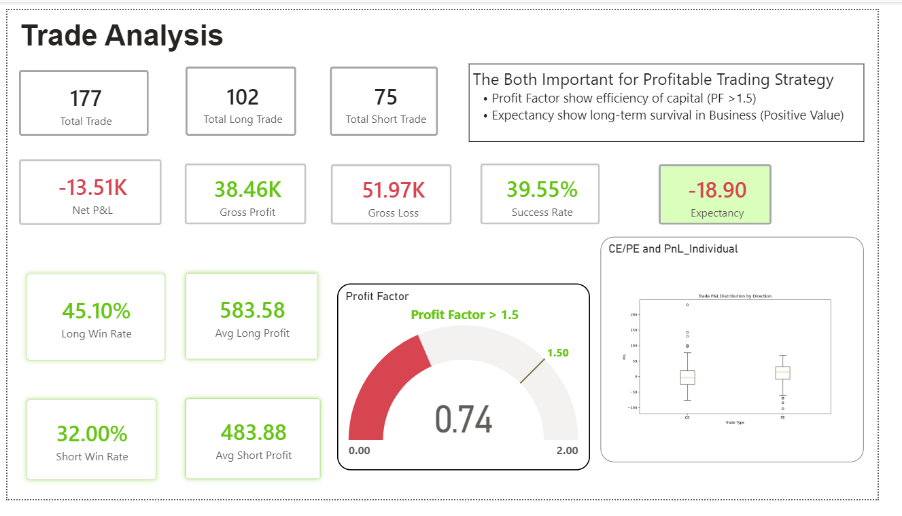

# Banknifty Trade Analysis

Analysing the trading system using Excel, Python and Power BI.

---
## Table of contents

- <a href="#Overview">Overview</a>
- <a href="#Trading-system-problem">Trading system problem</a>
- <a href="#Dataset"> Dataset</a>
- <a href="#Tools--Technologies">Tools & Technologies</a>
- <a href="#Project-Structure">Project Structure</a>
- <a href="#Data Cleaning--prepration">Data Cleaning \& prepration</a>
- <a href="#Research-Questions--Key-Findings">Research Question \& Key Findings</a>
- <a href="#Dashboard">Dashboard</a>
- <a href="#Final-Recommendations">Final Recommendation</a>
- <a href="#Author--Contact">Author \& Contact</a>

---
<h2> Overview </h2>

This project establishes a rigorous, automated analytics framework to analyze the financial viability of a BankNifty algorithmic options trading strategy. By parsing historical transaction ledgers, the pipeline isolates systemic performance disparities between Long (CE) and Short (PE) position execution to determine long-term operational survival.

---
<h2>Business Problem</h2>

Many derivative traders scale automated systems without verifying their statistical edge, mistaking random market noise for true alpha. This project addresses:

* Identifying directional structural decay (CE vs. PE execution performance).

* Dissecting capital attrition metrics (why losses heavily outpace profits).

* Quantifying the overall mathematical expectancy of the current deployment parameters.

---
<h2>Dataset</h2>

1.Trade-Data (Fact Table)

Houses granular transaction-level records populated from execution logs:

* CE/PE: Categorical classification of the option contract type.

* Date: Temporal execution timestamp.

* Entity: Underlying contract identification markers.

* Entry / Exit: Numeric price points capturing position entry and closure parameters.

2.Fundamental (Measure Table)

A specialized dimensions-style table hosting optimized DAX measures to run vector-based financial equations dynamically across visual filters:

* Trade Volume Drivers: Total Trade, Total Long Trade, Total Short Trade, Winning Trade, Losing Trade.

* Profitability KPI Expressions: Net P\&L, Gross Profit, Gross Loss, Avg Win, Avg Loss.

* System Viability Metrics: Success Rate, Long Win Rate, Short Win Rate, Profit Factor, Expectancy.

---
<h2>Tools & Technologies</h2>

* Data Logging: Microsoft Excel (Tabular transaction entry storage)

* ETL \& Data Modeling: Power Query (M Language) \& Power BI Desktop

* Calculations Engine: DAX (Data Analysis Expressions) for adaptive financial modeling

* Advanced Data Visualization: Python (Pandas, Matplotlib, Seaborn embedded visuals)

---
<h2>Project Structure</h2>

banknifty-trade-analysis/

│

├── README.md

├── requirements.txt

│

├── data/

│   └── raw\_trade\_logs.xlsx              # Excel-based transaction ledger

│

├── notebooks/                           # Development notebooks for scratch visual drafting

│   └── distribution\_analysis.ipynb      # Matplotlib boxplot prototyping

│

├── dashboard/

│   └── banknifty\_analytics.pbix         # Master Power BI Dashboard file

---
<h2>Data Cleaning & Preparation</h2>

System Performance Summary (177 Total Trades):

* Net Financial Standing: Net P\&L of -13.51K, indicating a capital-depleting strategy.
* Asymmetric Failure: Gross Profit (38.46K) is completely outstripped by Gross Losses (51.97K).
* Execution Asymmetry: Long trades (CE) significantly outperform short trades (PE) across both Success Rate (45.10% vs. 32.00%) and Payout Size (583.58 vs. 483.88 average profit).

---
<h2>Research Questions & Key Findings</h2>

1. Does the strategy demonstrate long-term viability?

No. The strategy has an overall Profit Factor of 0.74. Any system dropping below a benchmark threshold of 1.5 indicates that capital is utilized inefficiently.

2. What is the mathematical drag per trade?

The system has a Negative Expectancy of -18.90. This means every position entered mathematically bleeds capital over time, regardless of position sizing.

3. Where is the system's structural bottleneck?

The short execution setup (PE) is the core operational liability. A low 32.00% win rate

combined with a smaller average profit floor confirms that current entry/exit rules are poorly suited for down-trending or sideways market regimes.

---
##### Dashboard
Here My Power BI Dashboard 

---
<h2>Final Recommendations</h2>

* Surgically Halting Short Execution: Immediately suspend the short-side (PE) execution parameters until further rules optimization is completed to stop active capital drawdown.

* Implement Strict Stop-Loss Rules: Introduce maximum hard risk parameters to limit outsized losses from inflating the current 51.97K gross loss threshold.

* Incorporate Volatility Filtering: Integrate India VIX tracking as a dimension table inside the model to dynamically restrict entries during low-premium environments.

---
<h2>Author & Contact</h2>
Rohit Rajbhar  
Data Analyst   
📧 Email: rohitrajbharmail@gmail.com   
🔗 [LinkedIn](https://www.linkedin.com/in/rohit-rajbhar-public/)
